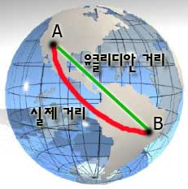

# Geometric Deep Learning: Going Beyond Euclidean Data
-------------------------------------------------------
You can see the original paper in [here](https://arxiv.org/pdf/1611.08097.pdf).

## 1.1 Euclidean 공간이란?

Euclidean 공간(혹은 Euclidean Geometry)란, 수학적으로 [유클리드]()가 연구했던 평면과 공간의 일반화된 표현이다.

좁은 의미에서 유클리드 공간은, [피타고라스의 정의]()에 의한 길이소의 제곱의 계수가 모두 양수인 공간을 이야기한다.
넓은 의미에서 유클리드 공간은, [그리드(Grid)]()로 표현이 가능한 모든 공간을 일컫는다.
이 때 그리드(Grid)는, 시간과 공간적 개념을 모두 포함하며, 대표적인 예시로는 '2D 이미지', '3D Voxel', '음성' 데이터 등이 있다.

[:2D 이미지]
[:3D Voxel]
[:음성]

## 1.2 Non Euclidean 공간이란?

문자 그대로 'Euclidean 공간이 아닌 공간'을 지칭하며, 대표적으로 두 가지를 들 수 있다.

### [1.2.1 Manifold]()

Manifold란, 두 점 사이의 거리 혹은 유사도가 근거리에서는 유클리디안(Euclidean metric, 직선거리)를 따르지만 원거리에서는 그렇지 않은 공간을 일컫는다.

이해가 쉬운 가장 간단한 예로는, 구의 표면(2차원 매니폴드)를 들 수 있습니다. 3차원 공간에서 A점과 B점 사이의 유클리디안 거리(초록선)과 실제의 거리(geodesic distance, 빨간선)는 일치하지 않는 것을 볼 수 있습니다.

### [1.2.2 Graph]()

Graph란, 일련의 노드의 집합 V와 연결(변)의 집합 E로 구성된 자료 구조의 일종이다.
일반적으로 노드에는 데이터가, 엣지엔 노드와 노드 사이의 관계 정보가 포함되어 있습니다.

